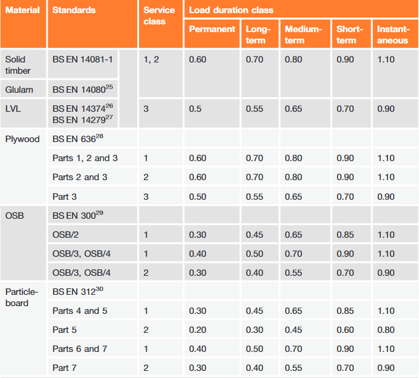

# Timber Notes and manual on timber class use
These notes are developed in conjunction with the structensor timber class module for the structural design of timber. 
## Work Flow
- Import the timber module
- Create a TimberBeam instance give the cross section size (b,h), the timber grade, the service class and the duration of loading. Include the effective length about both axis for axial capacities
- Use the capacity check function to establish the ULS capacity of the section
# Background Data
## Kmod Values

## Kdef Values

## Material Partial Factors

## Advice on notches and holes

If the following is applicable not account need be taken in the calculations for the holes and notches. 

- Notches not exceeding 0.125h are located between 0.07l and 0.25l from a support
- Holes drilled at the neutral axis have a diameter not exceeding 0.25h and centres at least three diameters apart located 0.25–0.4l from a support. Where adjacent holes are not of the same diameter, the maximum diameter should be used to calculate the spacing between holes. 

In addition, a gap of at least 200mm should be maintained between the edge of a notch and the edge of the nearest hole. For beams deeper than 250mm these rules will be safe if h is taken tobe 250mm. Additional information on these requirements may be found in Sections 10 and 11 of PD 6693.
